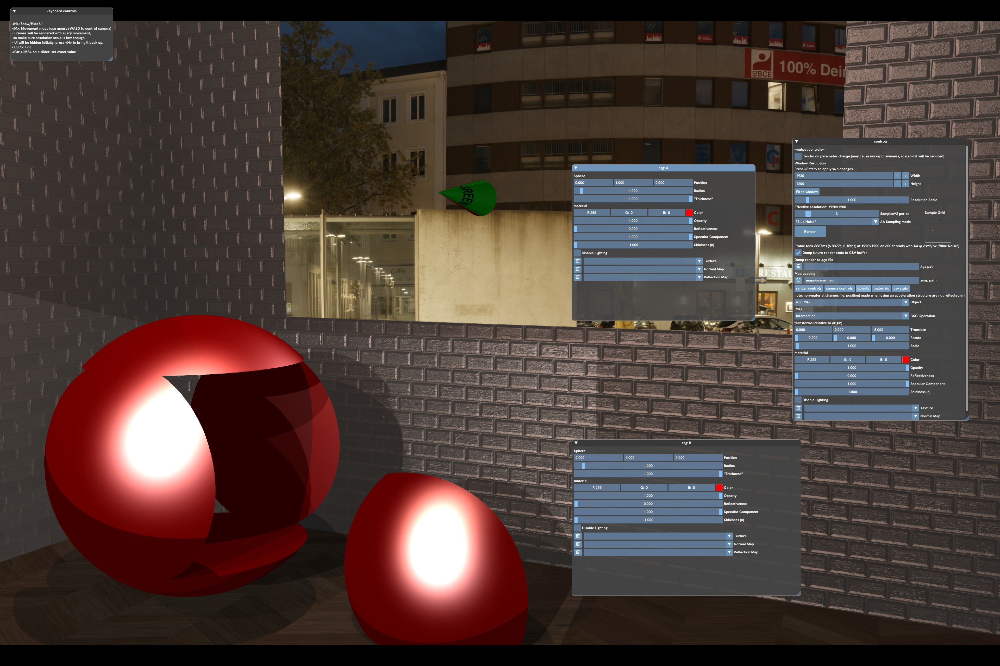
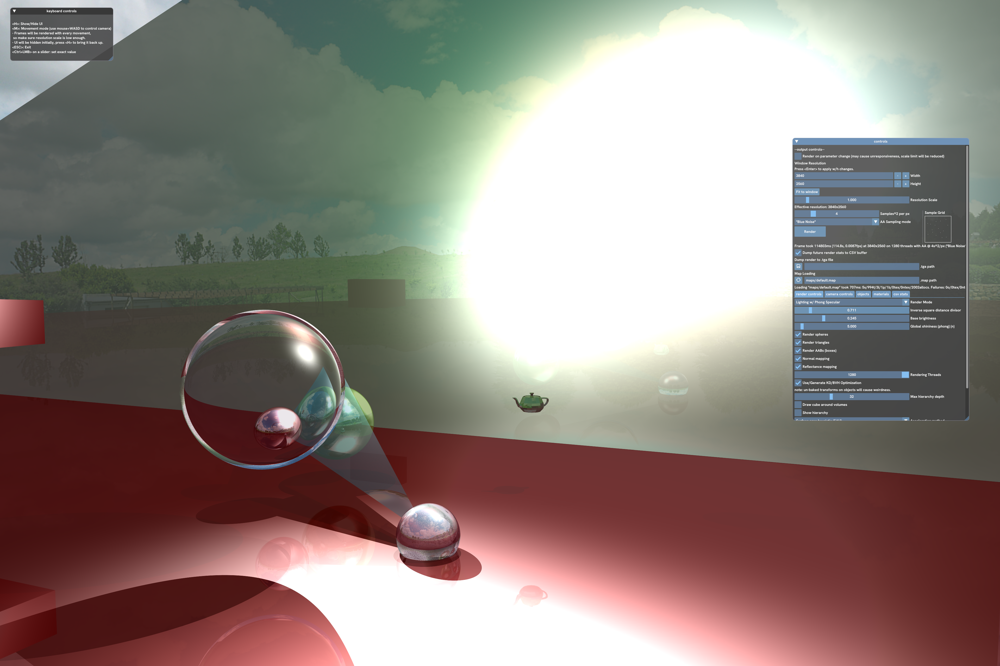
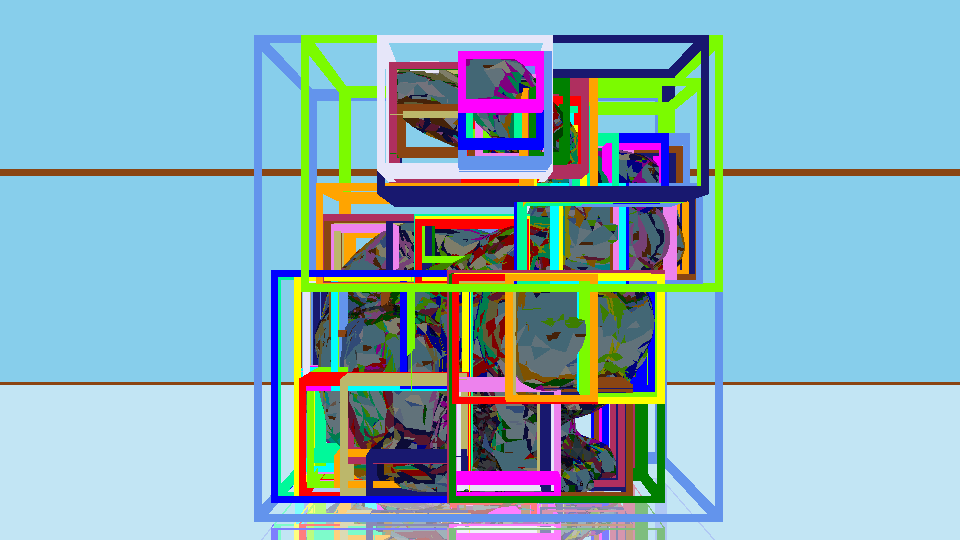

# rt

A CPU-based whitted-style ray tracer with some acceleration methods, including multithreading, bounding volume hierarchies (+ multiple generation strategies) and voxel traversal. Supports a variety of "shape"s:
* Triangles
* Spheres
  * "thickness" parameter allows hollow spheres.
* Axis-aligned (bounding) boxes (AABs)
* Planes (a flag for a triangle), Cylinders, Cones (Unsupported by BVHs)
* Constructive Solid Geometry (CSG)
  * Intersection, Union, Difference (+ Difference w/ Hollow subject a.k.a. "window") of any voluminous shape, including other CSGs

"Diffuse", normal, and reflection textures/maps can be attached to most of the shapes, although with limited adjustments possible (e.g. offsets).

Reflections and refraction are available, however refraction is limited to spheres as of now. There is no real concept of volumes as of yet for these effects, so outside of spheres things don't look great.

Basic multi-sample antialiasing is available, and the strategy used to choose sub-pixel sample locations can be changed between Grid, Random and ["Blue Noise"](https://computergraphics.stackexchange.com/a/4254).

An imgui-based UI allows parameter control of render, scene properties and acceleration methods. Images can be saved (and read) in TGA format only.

# Scene Format

"Scenes" are defined in a custom format, which I hope is described fully by the below (rough) EBNF:
```
<string> ::= <word> | "{<word>}"
// Number of times to tile texture on axis, or a = auto (i.e. fit to maintain aspect ratio)
<tilecount> ::= a|<int>
<axis> ::= x|y|z
<texpath> ::= <filepath>[:<tilecount>,<tilecount>[,<axis>]
<filepath> ::= <string>
<coord> ::= <float> <float> <float>
<sphere> ::= sphere center <coord> radius <float> [thickness <float>]
<triangle> ::= triangle a <coord> b <coord> c <coord>
<box> ::= box a <coord> b <coord>
<cylinder> ::= cylinder center <coord> radius <float> length <float> axis <axis>
<cone> ::= cone center <coord> radius <float> length <float> axis <axis>
<color> ::= <coord> | rgba(<int8>, <int8>, <int8>) | #<hexcolor>
<matprops> ::= [color <color>] [opacity <float>] [reflectiveness <float>] [specular <float>] [shininess <float>] [tex <texpath>] [norm <texpath>] [refmap <texpath>]
<material> ::= material <string> <matprops>
<shape> ::= (<sphere> | <triangle> | <box> | <cylinder> | <cone>) [<matprops> | material <string>]
<pointlight> ::= pointlight center <coord> [color <color>] [brightness <float>] [specular <float> color <color>]
// note: window is difference, except the subject (the first shape is treated as hollow. Pretty much tailor made for cutting a window into a AAB room.
<csgop> ::= intersection|union|difference|window 
// Note: <csggroup> is technically a shape, however I don't believe my parser implementation supports nesting them so I don't include it in <shape>.
<csggroup> ::= <csgop> {
    <shape>
    <shape>
} [<matprops> | material <string>] [<transform>]
<campreset> ::= campreset <string> pos <coord> phi <float> theta <float> fov <int>
<comment> ::= // {<word>}
<transform> ::= [translate <coord>] [rotate <coord>] [scale <float>]
<include> ::= include <filepath> [<transform>]
<map> ::= map dimensions <coord> [brightness <float>] [shininess <float>] [movespeed <float>]
<line> ::= [(<shape> | <csggroup> | <material> | <pointlight> | <campreset> | <comment> | <include>) (\n | \r)]
<file> ::= [<map>] {<line>}
```
You're not a computer though, so the various scenes in `maps/` may be helpful, particularly `scene.map`.

# Screenshots/Renders






Also see the `scrots/` directory for some more older screenshots.

# Structure

* `src/`: `.cpp` files.
* `main/`: Main executable and source.
* `include/`: `.hpp` files.
* `maps/`: Scene and model files.
* `scrots/`: Screenshots & renders.
* `objparser/`: Contains the objparser script for convert wavefront OBJ files to the internal format.

# Build

Compilation has only been completed on Linux, modification to build files likely required to use non-system GLFW.

Submodules are used, ensure they are available:
```
$ git submodule update --init --recursive
```
Additionally, ensure CMake, OpenGL and GLFW are available on the system.
```sh
$ cmake -S . -B build # generate build files
$ cmake --build build -j $(nproc) # compile
$ cmake --build build --target clean # clean
```
# Targets

* `main/main`: Main ray-tracer application.
* `timings/timings`: Program to comparing triangle/sphere intersection performance.


# License

Parts of the software were written as part of a software project module at the University of Leeds, though a large amount of work was conducted after submission. Per my understanding of the UoL's [IPR Policy document](https://secretariat.leeds.ac.uk/wp-content/uploads/sites/109/2022/12/ipr_policy.pdf), I retain ownership of the source code and therefore the right to publish the code here. The same likely applies to the report I wrote on the software, but it being directly assessed material makes me weary to publish. I don't believe the code as-is will have any use to others so I am not attaching a license.
